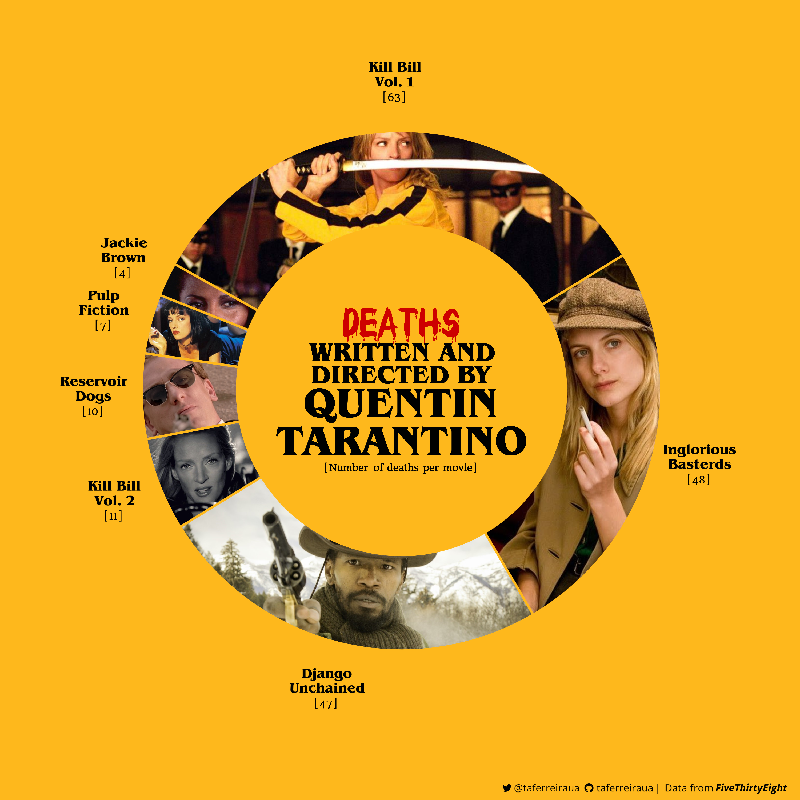
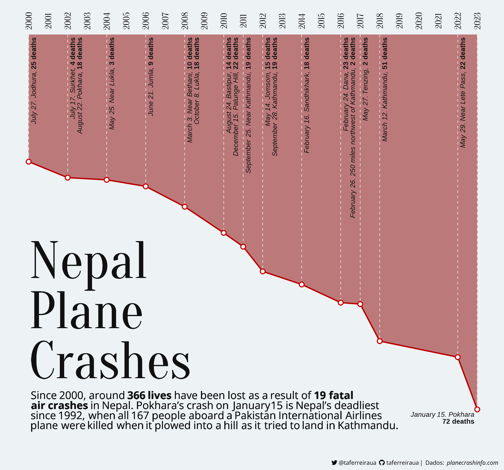
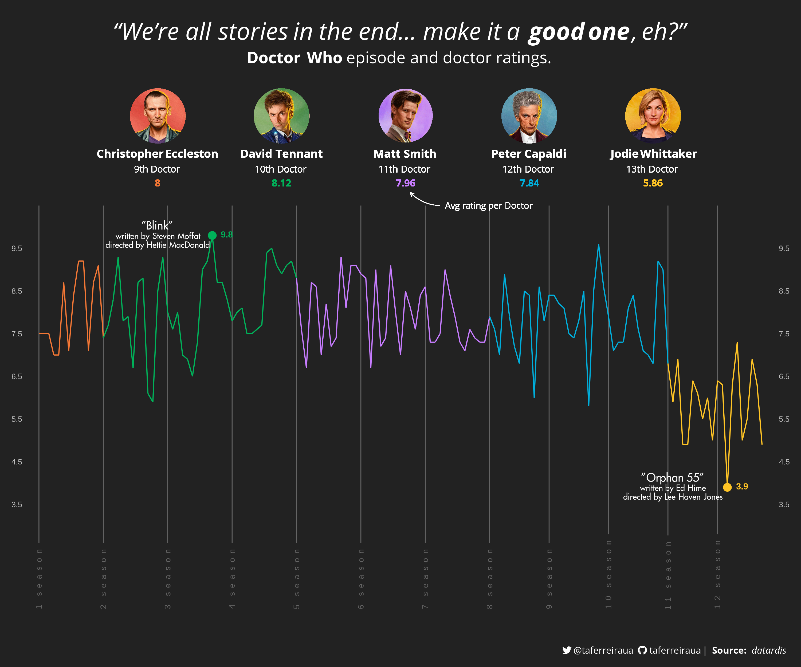

# 30DayChartChallenge
Contribuições para o #30daychartchallenge.

## **Day 1 - Part to whole:**
### [_Deaths written and directed by Quentin Tarantino_](Day1/Deaths-Tarantino.R)
  - 📦 Packages: `ggplot` `ggtext` `ggpattern`
  - 💾 Dados: FiveThirtyEight
  
  

## **Day 2 - Waffle:**
### [_Positividade no twitter africano_](Day2/AfriSenti.R)
  - 📦 Packages: `ggplot` `ggtext`
  - 💾 Dados: African Language Sentiment(AfriSenti)
  
  

## **Day 3 - Fauna/Flora:**
### [_Numbats sightings recorded since 2016_](https://github.com/taferreiraua/TidyTuesday/blob/main/2023/W10/07-03-2023-Numbats.R)
  - 📦 Packages: `ggplot` `ggtext` `ggimage`
  - 💾 Dados: Atlas of Living Australia
  
  

## **Day 4 - Historical:**
### [_Nepal Plane Crashes_](Day4/Nepal-Plane-Crashes.R)
  - 📦 Packages: `ggplot` `ggtext`
  - 💾 Dados: Plane Crash Info
  
  
  
## **Day 5 - Slope:**
### [_"We're all stories in the end..."_](Day5/doctorwho.R)
  - 📦 Packages: `ggplot` `ggtext` `ggimage`
  - 💾 Dados: Datardis
  
  

## **Day 6 - Data Day (OWID):**
### [_The rise of the mega-cities_](Day6/city-population.R)
  - 📦 Packages: `ggplot` `ggtext` `ggbump`
  - 💾 Dados: Our World In Data
  
  
